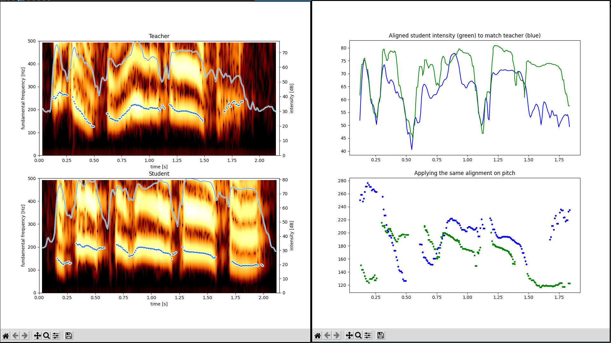
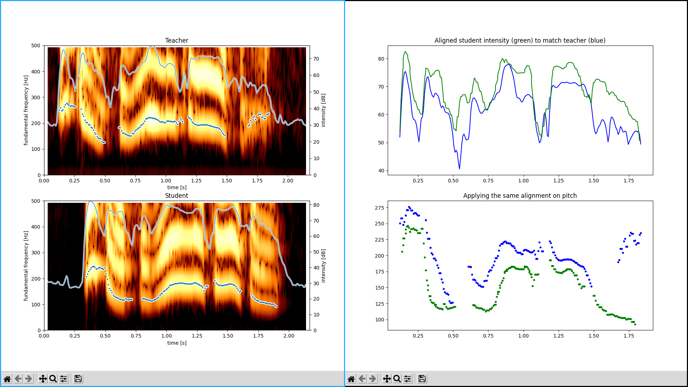

Onsei: Japanese pitch accent practice tool
===========================================

[](https://mybinder.org/v2/gh/itsupera/onsei/HEAD?urlpath=voila/render/work/notebook.ipynb)
[](https://gitter.im/itsupera-onsei/community?utm_source=badge&utm_medium=badge&utm_campaign=pr-badge)
<span class="badge-buymeacoffee">
<a href="https://www.buymeacoffee.com/itsupera" title="Donate to this project using Buy Me A Coffee"></a>
</span>

This project aims at creating tools to automatically assess the pitch accent accuracy
of a Japanese language learner, and help them practice their pitch-accent at the sentence level.

- **PLEASE NOTE THAT THIS IS AN EXPERIMENTAL WORK IN PROGRESS !**

- **Feedbacks and suggestions are welcome => [Gitter chat](https://gitter.im/itsupera-onsei/community?utm_source=badge&utm_medium=badge&utm_campaign=pr-badge) or Github issues**

How to play with it
--------------------

[Click here](https://mybinder.org/v2/gh/itsupera/onsei/HEAD?urlpath=voila/render/work/notebook.ipynb)
to deploy the web interface.

Note that this can take a few minutes to load !

Did you like it ? Please consider [donating](https://www.buymeacoffee.com/itsupera) to help me support future developments, thank you !

What is it for ?
-----------------

As Japanese is a pitch-accent based language, foreign learners that don't have a
pitch-accent or tonal mother tongue will likely struggle to identify and reproduce
the correct pitch patterns.

If you are completely novice to pitch-accent, I suggest you first start with an
introductory course such as [this one](https://www.kanshudo.com/howto/pitch).

Practicing with sentence rather than individual words is interesting
because there is a difference between the theoretical accent patterns in a sentence
and how native speakers actually say it, for many reasons
(emphasis on certain words, emotions, slurred speech...)

Setup
------

The following instructions have been tested on Ubuntu 20.20.

Since there are many dependencies to compile from source, the easiest way is
to build using Docker:

```bash
docker build -t onsei .
```

Then run the following command:
```
docker run -p 8866:8866 -v "$PWD":/home/jovyan/work --entrypoint=voila onsei:latest
````
Open the interface in your web browser: http://localhost:8866/voila/render/work/notebook.ipynb


For development purpose, run the JupyterLab:
```bash
docker run -p 8888:8888 -e JUPYTER_ENABLE_LAB=yes -v "$PWD":/home/jovyan/work onsei:latest
```
Open the notebook in your browser: http://127.0.0.1:8888/lab/tree/notebook.ipynb

Alternatively, it should build with `jupyter-repo2docker`
```bash
pip3 install jupyter-repo2docker
jupyter-repo2docker -E .
```


Using the CLI
--------------

Note: you probably want to use the Jupyter notebook first, see instructions above.

For more advanced usages, a CLI is available.

### Visualize a recording

```bash
python3 -m onsei.cli view \
    "data/ps/ps1_boku_no_chijin-teacher2.wav" \
    --sentence "僕の知人の経営者に"
```

### Comparing teacher and student recordings

The following script compares teacher and student recordings of the same sentence,
show a bunch of graphs to visualize the differences and computes a distance, i.e.,
how close the student pronunciation is to the teacher's.

Here is an example with the sentence 僕の知人の経営者に (boku no chijin no keieisha ni).
The sample recordings are:
- `data/ps/ps1_boku_no_chijin-student1.wav`: student mispronouncing words
- `data/ps/ps1_boku_no_chijin-teacher2.wav`: teacher repeating with correct pronunciation
- `data/ps/ps1_boku_no_chijin-student3.wav`: student trying again and fixing the mistakes

First comparing the mispronounced sentence with the teacher's:
```bash
python3 -m onsei.cli compare \
    data/ps/ps1_boku_no_chijin-teacher2.wav \
    data/ps/ps1_boku_no_chijin-student1.wav \
    --sentence "僕の知人の経営者に"
# Mean distance: 1.21 (smaller means student speech is closer to teacher)
```


Then comparing the rectified sentence with the teacher's:
```bash
python3 -m onsei.cli compare \
    data/ps/ps1_boku_no_chijin-teacher2.wav \
    data/ps/ps1_boku_no_chijin-student3.wav \
    --sentence "僕の知人の経営者に"
# Mean distance: 0.57 (smaller means student speech is closer to teacher)
```

(Note that the natural offset in the pitch is removed when we normalize the pitches to compute the distance)

As the student fixes the mistakes, we can see that the computed distance lowers.

### Other commands

To see other possible commands, see the help of the CLI:
```bash
# List of the commands
python3 -m onsei.cli --help

# Details on a specific command
python3 -m onsei.cli <command> --help
```


Methodology
------------

If you are interested in the way the comparison process works, here is an overview:

- Crop both recordings to remove the noise before and after the sentence
- Segment both recordings to find where each phoneme starts and ends
- Align the student recording with the teacher's, using [Dynamic Time Warping (DTW)](https://en.wikipedia.org/wiki/Dynamic_time_warping) based on detected phonemes (by default) or on speech intensity
- Apply the same alignment on the pitch signals and normalize them
- Compute a mean distance based on the aligned and normalized pitch signals